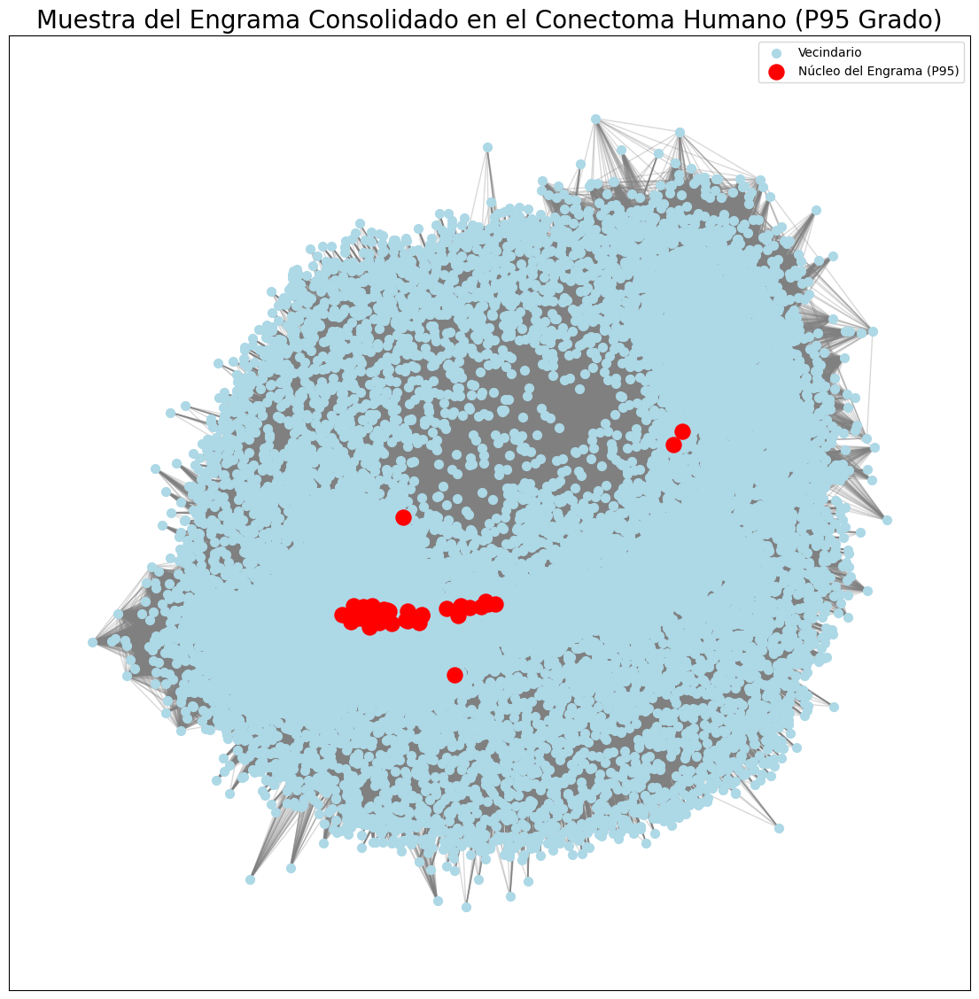

[Read this page in English](README_EN.md)

# El Operador de Refuerzo Topológico (ORT): Un Principio de Parsimonia para la Consolidación de Memoria

**Autor**: José Ignacio Peinador Sala 
[](mailto:joseignacio.peinador@gmail.com)
[](https://orcid.org/0009-0008-1822-3452)
[](https://creativecommons.org/licenses/by-nc/4.0/)
[](https://www.python.org/downloads/)
[](https://doi.org/10.21203/rs.3.rs-XXXXXXX/v1)
[](https://doi.org/10.5281/zenodo.17176412)

---

Este repositorio contiene la investigación y el código del **Operador de Refuerzo Topológico (ORT)**, un principio computacional que emula la consolidación de engramas de memoria en redes complejas.

El proyecto valida que la memoria funcional y resiliente puede emerger directamente de la organización topológica de una red, revelando un principio de **parsimonia computacional** con plausibilidad biológica.


*Visualización de una muestra del engrama P95 en el conectoma humano, revelando una estructura "core-periphery" y una organización "rich-club".*

---

## 🎯 Hallazgos Principales

* **🧠 Principio Dual (Masa Crítica vs. Élite):** Las redes biológicas optimizan la memoria con núcleos de **"élite"** (P95), mientras que las redes de información requieren una **"masa crítica"** (P90) para ser resilientes.
* **🔗 Especificidad Topológica:** La función de la memoria **colapsa (F1-score ≈ 0)** si se altera la configuración precisa de la red cerebral, probando que no solo importan los hubs, sino cómo están conectados.
* **⚡ Parsimonia Computacional:** El ORT basado en Grado es **~96x más rápido** y consume **~19x menos RAM** que PageRank, logrando un rendimiento funcional comparable.
* **✅ Plausibilidad Biológica:** El ORT alcanza un rendimiento excepcional (**F1-score ~87%**) en la recuperación de memoria en el conectoma humano.

---

## 🔬 Experimentos Interactivos

### **Requisitos de Datos**

Para ejecutar los experimentos con conectomas biológicos:
1.  Descarga el archivo `.edges` desde la fuente original
2.  Súbelo al almacenamiento de Google Colab antes de ejecutar

* **Conectoma de Macaco**: [Network Repository](https://networkrepository.com/bn-macaque-rhesus-cerebral-cortex-1.php)
* **Conectoma Humano**: [Network Repository](https://networkrepository.com/bn-human-BNU-1-0025890-session-1.php)

### **1. Experimento Fundamental: ORT en Redes y Conectomas**
Pipeline completo desde GNN hasta validación en múltiples datasets.

[](https://colab.research.google.com/drive/1jMDuMRp19TGHzQir38zZAPpD-nwImIru?usp=sharing)

### **2. Viaje al Cerebro: ORT en Conectoma Humano**
Aplicación directa a un cerebro humano digitalizado.

[](https://colab.research.google.com/drive/1xWD80iABtZElrThMHKnRwQGUcn4ENEU5?usp=sharing)

---

## 📂 Estructura del Repositorio

* **`/Notebooks`**: Todos los cuadernos de experimentos (español e inglés)
* **`/Reports`**: Artículos de investigación completos (español e inglés)  
* **`/outputs`**: Resultados generados por los experimentos
  * `/csv`: Datos cuantitativos en formato CSV
  * `/img`: Visualizaciones y gráficos
* `LICENSE`: Licencia MIT del proyecto

---

## 🔬 Ciencia Independiente y Abierta

Este trabajo se realizó de manera completamente independiente, sin financiación institucional ni corporativa, demostrando que la investigación de frontera puede surgir también desde entornos abiertos y accesibles.

[](https://github.com/sponsors/NachoPeinador)

---

## 🚀 Apoya y Difunde esta Investigación

Como investigador independiente, la visibilidad de este trabajo depende en gran medida del apoyo de la comunidad científica y de entusiastas como tú. Si este proyecto te ha resultado interesante o útil, aquí tienes algunas formas muy concretas en las que puedes ayudar a darle visibilidad:

* **⭐️ Dale una Estrella en GitHub:** Si te gusta el repositorio, haz clic en el botón **"Star"** en la parte superior de la página. Es un indicador de calidad clave que ayuda a que otros descubran el proyecto.

* **🔄 Comparte en Redes Sociales:** Publica el enlace al preprint de Research Square o a este repositorio en **Twitter (X)**, **LinkedIn** o tu red académica preferida. Un simple post puede tener un impacto enorme. No dudes en mencionarme `@todos_lumpen`.

* **✍️ Cita el Trabajo:** La forma más importante y duradera de apoyo en la ciencia es la citación. Si mi artículo, código o metodología inspira o es útil para tu propia investigación, por favor, considera citarlo.

* **💬 Inicia una Discusión:** Si tienes preguntas, ideas para futuras investigaciones o críticas constructivas, no dudes en abrir un **"Issue"** aquí en el repositorio. ¡Me encantaría conocer tu opinión y debatir sobre los resultados!

¡Gracias por tu apoyo para hacer visible la ciencia independiente!

---

## ✍️ Citación

```bibtex
@article{peinador2025tro,
      author = {Jos{\'e} Ignacio Peinador Sala},
      title = {The Topological Reinforcement Operator (TRO): A Parsimony Principle for Memory Consolidation in Complex Networks},
      year = {2025},
      journal = {Research Square},
      doi = {10.21203/rs.3.rs-XXXXXXX/v1}
}
